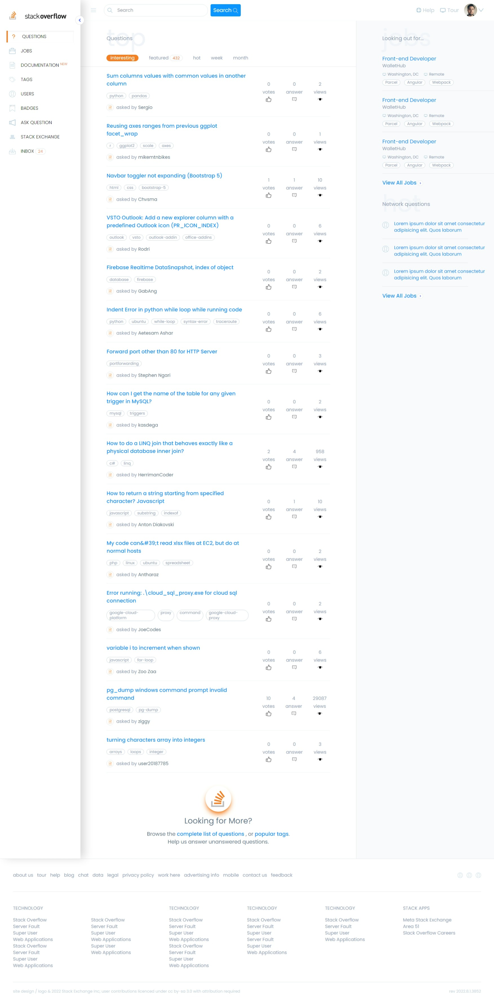

# Stack Overflow-v2

## Table of Contents

- [Overview](#overview)
  - [Screenshot](#home-page-preview)
  - [Links](#links)
- [My process](#my-process)
  - [Built with](#built-with)
  - [Features](#features)

----

## Overview

Welcome to my website on creating a stack-overflow clone.

## Links

- Live Site Link: [Click Here](https://stack-overflow-v2.netlify.app/) to see the Live website.
- Client side Github Repo: [Click Here](https://github.com/kamrulsaad/stack-overflow-v2) to check my client side github repo for this project.

## Home Page Preview

----

## My Process

I have built this website following the requirements provided.

## Future Process

I would like to implement the search functionality using `redux` architecture and create a much more dynamic working UI for the better understanding of my skills.

## Built With

- `react`, `react-dom`
- `tailwindCSS`
- `react-query`
- `svg-repo`

------

## Features

Users should be able to:

- See a Beautiful home page
- See dynaminc data for the questions
- CLicking on the title of the questions will take user to the details of that question. 